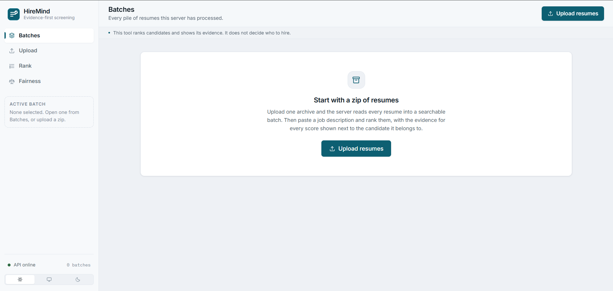
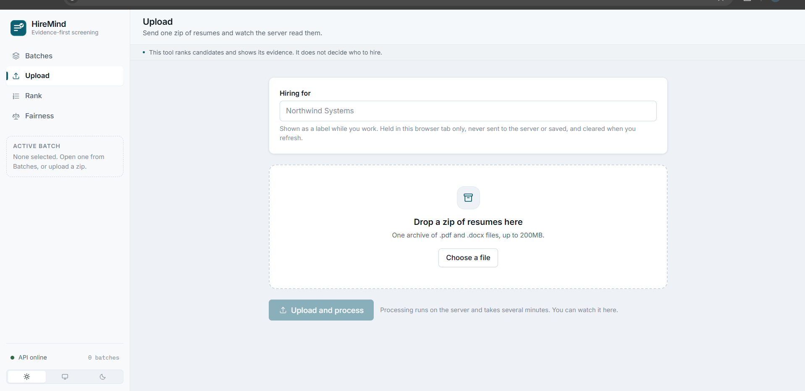
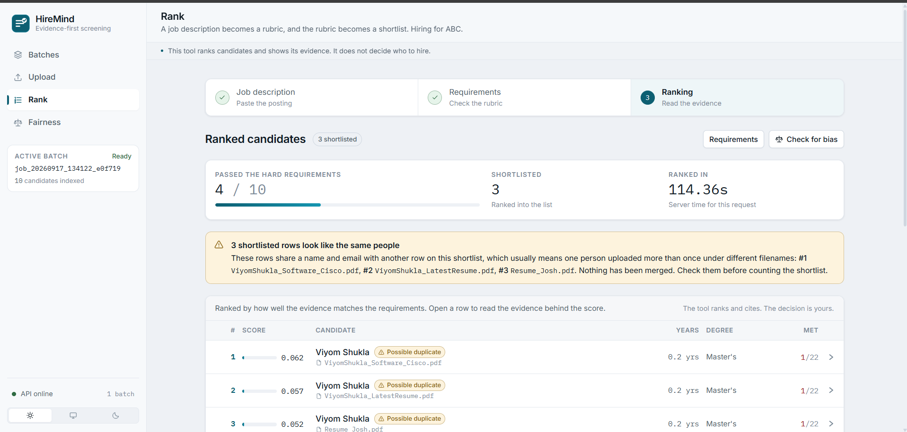
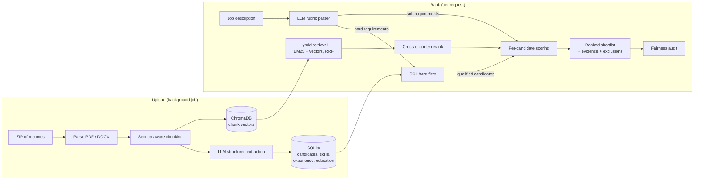

<div align="center">

# HireMind

**Evidence-first candidate screening with retrieval-augmented generation**

Upload a zip of resumes, paste a job description, and get a ranked shortlist in which every score shows the resume evidence behind it.
The tool ranks candidates and shows its evidence. **It does not decide who to hire.**


</div>

---

## Demo

<video src="frontend/assests/Recording%202026-09-17%20134527.mp4" controls width="100%"></video>

▶️ **[Watch the full walkthrough](frontend/assests/Recording%202026-09-17%20134527.mp4)**: uploading a batch, reviewing the inferred requirements, reading the ranked shortlist with its evidence, and running the fairness audit.

---

## Screenshots

### Batches: the starting point
Every processed batch in one place. The sidebar shows the active batch, whether the API is reachable, and the light / system / dark theme switch.



### Upload: a zip of resumes
Drop one archive of `.pdf` and `.docx` files. The optional "Hiring for" label stays in the browser tab and is never sent to the server.



### Rank: a shortlist with evidence
Four of ten candidates passed the hard requirements. Each row shows its score, experience, degree and requirements met, with the original filename under the name. Rows that share a name and email are flagged as **possible duplicates**, and a warning explains that they may be one person counted three times.



---

## Table of contents

- [Demo](#demo)
- [Screenshots](#screenshots)
- [What it does](#what-it-does)
- [Features](#features)
- [How it works](#how-it-works)
- [Tech stack](#tech-stack)
- [Project structure](#project-structure)
- [Getting started](#getting-started)
- [Using the app](#using-the-app)
- [API reference](#api-reference)
- [Command-line scripts](#command-line-scripts)
- [Evaluation](#evaluation)
- [Configuration](#configuration)
- [Privacy and data handling](#privacy-and-data-handling)
- [Known limitations](#known-limitations)
- [Troubleshooting](#troubleshooting)

---

## What it does

Recruiters screening a stack of resumes want two things from software: a sensible ordering, and a reason for it. Most AI screening tools give a score and nothing else. HireMind is built around the reason.

1. **Upload** a `.zip` of `.pdf` and `.docx` resumes. The server parses, chunks, extracts structured data with an LLM, and indexes every resume in a background job.
2. **Paste a job description.** An LLM turns it into a *rubric*: separate hard requirements (must-haves that filter people out) and soft requirements (nice-to-haves that only move the score), each with a weight.
3. **Review the rubric before seeing anyone.** A requirement that was read too strictly removes qualified people, and this is where that gets caught.
4. **Read the ranked shortlist.** Every candidate row opens into a per-requirement breakdown with the quoted resume passage that earned each score.
5. **Audit the shortlist for bias.** Selection rates are compared across groups using the four-fifths (80%) rule.

---

## Features

**Ranking and evidence**
- A job description becomes a weighted rubric of hard and soft requirements.
- Hard requirements run as a SQL filter (minimum years, minimum degree, required skills). **Anyone removed is still listed, with the reason.**
- Every candidate is scored individually against each soft requirement, so nobody is skipped because a global search never reached them.
- Evidence is labelled by where it came from:
  - **Confirmed**: a structured fact from the extracted skills table.
  - **Read from resume**: a judgement about resume text, shown with the quoted passage.
  - **Not found**: shown explicitly, never hidden.
- Scores are a weighted *average*, so missing one nice-to-have costs its share and no more.

**Data quality**
- The original **filename** appears next to every candidate name, because two people can share a name.
- **Possible duplicates** are flagged: candidates in the same batch with the same name *and* email. They are never merged automatically.
- A per-file ingestion report shows scanned PDFs with no text, corrupt, password-protected, unsupported, oversized and duplicate files, and explains why each one cannot be ranked.

**Fairness**
- A disparate-impact audit of the shortlist using the EEOC four-fifths rule.
- Groups with fewer than 10 people are marked *too small to interpret* and left out of the ratio.
- A missing ratio is shown as "not enough data", never as a clean result.

**Engineering**
- Hybrid retrieval: dense vectors + BM25, combined with Reciprocal Rank Fusion, then a cross-encoder reranker.
- An LLM provider pool that stays under per-minute rate limits and fails over when a provider hits its daily quota. Extraction results are cached on disk, so an interrupted run can be resumed.
- Upload safety checks: zip-slip and zip-bomb protection, plus limits on file count and size.
- Deleting a batch removes it from every store: SQL rows, vectors, files and the job registry.

**Interface**
- A professional app shell with sidebar navigation, live API status, and the progress of the active batch on every screen.
- Light, dark and system themes.
- Responsive down to phone width, with visible keyboard focus and reduced-motion support.

---

## How it works



### The upload pipeline

| Stage | What happens | Where |
|---|---|---|
| Ingest | Unzips safely (zip-slip and zip-bomb checks) and gives each file a status | `app/ingestion/batch.py` |
| Chunk | Splits each resume into sections and entries. Every chunk carries `job_id` and `resume_id` | `app/chunking/chunker.py` |
| Extract | One LLM call per resume fills a validated Pydantic schema via `instructor`, with results cached on disk | `app/extraction/` |
| Load | Upserts candidates, deduplicated skills, experience and education, and flags likely duplicates | `scripts/load_database.py`, `app/db/` |
| Index | Embeds chunks and upserts them into ChromaDB | `app/retrieval/vector_store.py` |

The upload endpoint returns **202 Accepted** straight away. Processing takes minutes, mostly waiting on the rate-limited LLM, so the client polls for progress.

### The ranking pipeline

1. **JD parsing:** the job description is split into roughly ten separate requirements instead of being embedded as one averaged vector. Something is only a *hard* requirement if the JD says must, required or essential, and it can be checked by a machine. Anything else is downgraded to *soft*.
2. **Hard filter:** SQL removes candidates who fail a hard requirement and records the reason.
3. **Scoring:** for each qualified candidate and each soft requirement:
   - If the requirement names a skill, the **database** answers it (score 0.95 if present). Retrieval still runs to fetch a quote.
   - Otherwise, **hybrid retrieval** searches *only that candidate's* chunks and the reranker scores the best match. A quote below the relevance floor is not shown as evidence.
4. **Aggregation:** a weighted average over the requirements, then candidates are sorted and cut to the shortlist size.

### Why hybrid retrieval

| | Good at | Weak at |
|---|---|---|
| **Dense vectors** (BGE-small) | Paraphrase: "led a team" ≈ "managed engineers" | Exact terms, rare tokens, numbers ("2 years" ≈ "5 years") |
| **BM25** | Exact terms, product names, certifications | Synonyms: "Torch" never matches "PyTorch" |
| **RRF fusion** | Combines both using rank positions only, so the incompatible score scales never need a common unit | — |
| **Cross-encoder** | Accurate relevance on the top ~10 results, plus a calibrated floor for "is this actually evidence?" | Too slow to search everything, which is why it only reranks |

---

## Tech stack

| Layer | Technology |
|---|---|
| Frontend | React 19, TypeScript, Vite, Tailwind CSS v4, oxlint |
| API | FastAPI, Uvicorn, Pydantic v2 |
| Structured data | SQLite through SQLAlchemy 2.0 (the connection string is set in one place, so moving to PostgreSQL is a one-line change) |
| Vector store | ChromaDB (persistent, cosine space, one collection per embedding model) |
| Embeddings | `BAAI/bge-small-en-v1.5` via fastembed (default). Also sentence-transformers, Gemini, OpenAI, or an offline hash backend |
| Keyword search | `rank_bm25` with a tokenizer that keeps technical terms like `C++` and `Node.js` intact |
| Reranker | Cross-encoder via fastembed (`Xenova/ms-marco-MiniLM-L-6-v2`) |
| LLM extraction | `instructor` + OpenAI-compatible clients over a provider pool: Gemini, Groq (gpt-oss 120b / 20b), OpenAI, Anthropic |
| Document parsing | pdfplumber, python-docx |
| Synthetic data | Faker, ReportLab |

---

## Project structure

```
Rag-based-project/
├── backend/
│   ├── api/
│   │   ├── main.py              # FastAPI app and all HTTP endpoints
│   │   ├── pipeline.py          # background upload pipeline + in-memory job registry
│   │   └── schemas.py           # request/response models (what leaves the server)
│   ├── app/
│   │   ├── ingestion/           # safe zip handling, per-file status, parsers
│   │   ├── chunking/            # section-aware resume chunker
│   │   ├── extraction/          # LLM extraction, provider pool, schemas, skill vocabulary
│   │   ├── db/                  # SQLAlchemy models, session, duplicate detection
│   │   ├── retrieval/           # embeddings, Chroma store, BM25, RRF fusion, reranker
│   │   ├── ranking/             # JD parser and candidate scorer
│   │   ├── fairness/            # disparate-impact audit
│   │   ├── evaluation/          # chunking, extraction and retrieval evaluation
│   │   └── agent/               # placeholder for a future agent layer (empty)
│   ├── scripts/                 # CLI entry points for each pipeline stage
│   ├── data/
│   │   ├── sample_resumes/      # 50 synthetic resumes (PDF)
│   │   ├── sample_jds/          # 5 synthetic job descriptions
│   │   ├── ground_truth/        # exact records the samples were generated from
│   │   ├── candidates.db        # SQLite database (generated)
│   │   ├── chroma/              # vector index (generated)
│   │   └── cache/               # LLM and embedding caches (generated)
│   ├── requirements.txt
│   └── pyproject.toml
├── frontend/
│   ├── src/
│   │   ├── App.tsx              # view switching and session state
│   │   ├── api.ts               # the only module that talks to the backend
│   │   ├── api-types.ts         # generated from the backend's OpenAPI schema
│   │   ├── components/          # shell, brand, icons, tables, evidence, requirements
│   │   ├── views/               # Batches, Upload, Rank, Fairness
│   │   └── lib/                 # formatting, job polling, theme, API health
│   ├── index.html
│   └── vite.config.ts           # pinned to port 3000 (required by the API's CORS)
└── docs/
```

---

## Getting started

### Prerequisites

- **Python 3.11+**
- **Node.js 20+** and npm
- An API key for at least one LLM provider. The free tiers of **Groq** and **Google Gemini** are enough for the sample data.

### 1. Clone

```bash
git clone <your-repo-url> Rag-based-project
cd Rag-based-project
```

### 2. Backend

```bash
python -m venv venv

# Windows
venv\Scripts\activate
# macOS / Linux
source venv/bin/activate

pip install -r backend/requirements.txt
```

Create `backend/.env` with the keys for the providers you want to use. Any provider without a key is skipped.

```env
GROQ_API_KEY=your_groq_key
GOOGLE_API_KEY=your_gemini_key
# optional
GOOGLE_API_KEY_2=a_second_gemini_key
OPENAI_API_KEY=
ANTHROPIC_API_KEY=
```

Start the API **from the `backend` directory**:

```bash
cd backend
uvicorn api.main:app --reload --port 8000
```

Interactive API docs are at <http://localhost:8000/docs>. On first start the server creates or migrates the database schema. The first ranking request downloads the embedding and reranker models (a one-time download of a few hundred MB).

### 3. Frontend

In a second terminal:

```bash
cd frontend
npm install
npm run dev
```

Open <http://localhost:3000>.

> **The frontend must run on port 3000.** The API's CORS allowlist only admits `localhost:3000` and `127.0.0.1:3000`, so `vite.config.ts` pins that port with `strictPort`.

### 4. Try it with the sample data

Zip the synthetic resumes and upload the archive through the app:

```bash
# Windows (PowerShell)
Compress-Archive backend/data/sample_resumes/* sample_resumes.zip
# macOS / Linux
cd backend/data/sample_resumes && zip ../../../sample_resumes.zip * && cd -
```

Then paste any file from `backend/data/sample_jds/` as the job description.

---

## Using the app

| Screen | Purpose |
|---|---|
| **Batches** | Every uploaded batch, with status, file, parsed and candidate counts. Search by id, filter by state, open a batch, or delete it (with confirmation). |
| **Upload** | Drop a zip and watch the pipeline stages. When the batch is ready, see which files could not be ranked and why. |
| **Rank** | Three steps: **Job description → Requirements → Ranking.** You see the rubric and the exact filter before any candidate. |
| **Fairness** | Re-runs the ranking and reports selection rates and impact ratios for each proxy attribute. |

The sidebar always shows the active batch and its live progress, whether the API is reachable, and the theme switch.

---

## API reference

Base URL: `http://localhost:8000`

| Method | Endpoint | Description |
|---|---|---|
| `GET` | `/api/health` | Liveness check and number of known jobs |
| `POST` | `/api/upload` | Multipart upload of a `.zip` (max 200 MB). Returns **202** with a `job_id`; processing continues in the background |
| `GET` | `/api/jobs` | All batches, newest first |
| `GET` | `/api/jobs/{job_id}` | Progress, counts and per-file status for one batch |
| `DELETE` | `/api/jobs/{job_id}` | Deletes the batch from SQL, the vector store, files and the registry. Returns **409** while the batch is still processing |
| `POST` | `/api/rank` | Parses a JD and returns the rubric, filter, shortlist with evidence, and excluded candidates with reasons |
| `POST` | `/api/audit` | Ranks, then returns a disparate-impact audit of the shortlist |

**Rank / audit request**

```json
{
  "job_id": "job_20260912_221433_acb42f",
  "jd_text": "We are hiring a Senior Backend Engineer. Must have 5+ years ...",
  "shortlist_size": 45,
  "include_excluded": true
}
```

**Ranked candidate (abridged)**

```json
{
  "rank": 1,
  "resume_id": "Resume_Cloud",
  "source_file": "Resume_Cloud.pdf",
  "duplicates": [{ "resume_id": "Viyom_CV_2", "source_file": "Viyom_CV_2.docx" }],
  "name": "Viyom Shukla",
  "years": 6.2,
  "highest_degree": "master",
  "score": 0.8123,
  "requirements_met": 5,
  "requirements_total": 6,
  "passed_filter": true,
  "exclusion_reasons": [],
  "evidence": [
    {
      "requirement": "Experience operating Kubernetes in production",
      "weight": 3,
      "score": 0.91,
      "source": "retrieval",
      "quote": "Migrated 40 services to EKS and ran the on-call rotation..."
    }
  ]
}
```

After changing a backend schema, regenerate the frontend types with the API running:

```bash
cd frontend
npx openapi-typescript http://localhost:8000/openapi.json -o src/api-types.ts
```

---

## Command-line scripts

Every pipeline stage can also run on its own from `backend/`, which is useful for development and experiments.

| Script | Purpose |
|---|---|
| `scripts/generate_sample_resumes.py` | Generates synthetic resumes and their ground-truth records |
| `scripts/generate_sample_jds.py` | Generates synthetic job descriptions with graded relevance labels |
| `scripts/ingest_zip.py` | `--zip resumes.zip` or `--dir data/sample_resumes --job-id demo` |
| `python -m app.chunking.chunker` | Chunks the sample resumes into `data/chunks.json` (`scripts/run_chunking.py` is currently an empty placeholder) |
| `scripts/run_extraction.py` | LLM extraction; `--limit 5` to try a few first, `--no-cache` to ignore cached results |
| `scripts/load_database.py` | Loads extractions into SQLite; `--reset` to rebuild, `--stats` for a summary |
| `scripts/build_index.py` | Builds the vector index; `--reset`, `--backend hash` (offline), `--search "..."` |
| `scripts/run_jd_parsing.py` | Parses the sample JDs; `--file jd_002.txt`, `--limit 1`, `--no-cache` |
| `scripts/rank_candidate.py` | Ranks from the terminal; `--jd jd_001 --top 20` |
| `scripts/run_bias_audit.py` | `--jd jd_001 --shortlist 10`, or `--all` |

---

## Evaluation

Because the sample resumes are generated *from* structured records, every stage has an exact ground truth to measure against (`backend/data/ground_truth/`).

| Module | Measures |
|---|---|
| `app/evaluation/chunking_eval.py` | Chunk quality and section boundaries |
| `app/evaluation/extraction_eval.py` | LLM extraction accuracy against the generated records |
| `app/evaluation/retrieval_eval.py` | **Recall@k, nDCG@k and MRR** across five setups: dense only, BM25 only, hybrid, hybrid + rerank, and + SQL prefilter |

```bash
cd backend
python -m app.evaluation.retrieval_eval --depth 10
```

---

## Configuration

| Variable | Default | Purpose |
|---|---|---|
| `GROQ_API_KEY` | — | Groq provider (gpt-oss-120b, gpt-oss-20b) |
| `GOOGLE_API_KEY`, `GOOGLE_API_KEY_2` | — | Gemini providers |
| `OPENAI_API_KEY` | — | OpenAI provider (gpt-4o-mini) |
| `ANTHROPIC_API_KEY` | — | Anthropic provider (Claude Haiku 4.5) |
| `EMBEDDING_BACKEND` | `fastembed` | `fastembed`, `sentence-transformers`, `gemini`, `openai`, or `hash` |

Upload limits (in `app/ingestion/batch.py` and `api/main.py`): 200 MB per upload, 500 MB uncompressed in total, 25 MB per file, at most 1,000 files, and a maximum 200× compression ratio.

> Changing the embedding model creates a **new, empty** vector collection. Vectors from different models cannot be compared, so the old index is never queried with the wrong model.

---

## Privacy and data handling

Resumes are personal data. The design reflects that:

- **Batch isolation:** every chunk, vector and database row carries a `job_id`. A ranking only ever sees its own batch.
- **Complete deletion:** deleting a batch removes its SQL rows (with foreign-key cascades enforced), vectors, extracted files and uploaded archive. This is what makes a retention policy such as "delete after N days" possible under GDPR and India's DPDP Act.
- **The company name stays in the browser:** the "Hiring for" label lives only in React state. It is never sent to the server or saved, and it is cleared on refresh, so a stored pile of resumes is never linked to an employer.
- **Minimal responses:** API response models list their fields explicitly, so email, phone and model metadata are not returned by the ranking endpoints.
- **Secrets:** `.env` is git-ignored.

---

## Known limitations

- **The job registry is in memory.** Restarting the API loses batch *status*. The data stays on disk, but existing batches no longer appear in the Batches list. For production, Redis plus a Celery or RQ worker would fix this.
- **`resume_id` is the filename stem and must be unique across all batches.** Uploading a file with the same name in another batch overwrites the earlier candidate.
- **The fairness audit uses proxy attributes** (name locale, university tier, career gap, employment status) from the synthetic ground truth. Real resumes do not carry these, and with small groups the ratios are noisy. A flag is a reason to investigate, not a verdict.
- **Ranking is a single blocking request** (typically 15–60 s) with no progress streaming.
- **SQLite and in-process ChromaDB** suit a single machine only. The code is structured so that PostgreSQL and Qdrant can replace them.
- `app/agent/` is a placeholder and not implemented yet.

---

## Troubleshooting

| Symptom | Likely cause and fix |
|---|---|
| "Cannot reach the API" / sidebar shows **API offline** | The backend isn't running, or was started outside `backend/`. Run `uvicorn api.main:app --reload --port 8000` from `backend/`. |
| Every request fails with "Failed to fetch" | The frontend isn't on port 3000, so CORS rejects it. Stop whatever is using port 3000 and run `npm run dev`. |
| `503 no chunks indexed yet` | No batch has been uploaded and indexed yet. |
| `503 LLM provider unavailable` | No valid API key in `backend/.env`, or every provider has used up its daily quota. |
| Upload fails with a provider or quota error | Free-tier daily limits. Run again later; cached extractions are not re-requested. |
| A batch disappeared after restarting the API | Expected: the registry is in memory (see limitations). Upload the zip again. |
| A candidate scores 0 on everything | Check the file report for **No text found**: scanned, image-only PDFs have no text layer. |
| `409` when deleting | The batch is still processing. Wait until it is Ready or Failed. |
